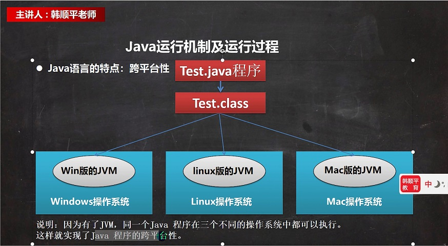

# 第1章 Java概述

## 1.1 Java诞生小故事

- 1990 Sun公司绿色计划
- 1992 创建oak（橡树）语言->Java
- 1994 James Gosling参加硅谷大会，演示Java功能，震惊世界
- **1995 Sun发布Java第一个版本**
- 2009 甲骨文收购Sun。2011 发布Java7

## 1.2 Java技术体系平台

**Java SE（Java Standard Edition）标准版**

支持面向桌面技术的应用（如Windows下的应用程序）的Java平台，提供了完整的Java核心API，此版本以前称为J2SE。

**Java EE（Java Enterprise Edition）企业版**

是为企业开发环境下的应用程序提供的一套解决方案。该技术体系中包含的技术如：Servlet、JSP等，主要针对Web应用程序开发。版本以前称为J2EE。

**Java ME（Java Micro Edition）小型版**

支持Java程序运行在移动终端（手机、PDA）上的平台，对Java API有所精简，并加入了针对移动端的支持，此版本以前称为J2ME。

## 1.3 Java开发工具

- editplus++
- Sublime Text
- IDEA
- Eclipse

## 1.4 Java特性

**Java的重要特点**

1. Java是面向对象的（OOP）
2. Java语言是健壮的。Java的强类型机制、异常处理、垃圾的自动收集等是Java程序健壮的重要保证
3. Java语言是跨平台性的。【即：一个编译好的.class文件可以在多个系统下运行，这种特性称为跨平台性。】
4. Java语言是解释型的

解释型语言：JavaScript、PHP、Java，编译型语言：C/C++

区别是：解释型语言，编译后的代码，不能直接被机器执行，需要解释器来执行，编译型语言，编译后的代码，可以被机器执行

## 1.5 JDK介绍

因为有了JVM，同一个Java程序在三个不同的操作系统中都可以执行。

这样就实现了Java程序的跨平台性

### 1.5.1 Java运行机制及运行过程

- Java核心机制-Java虚拟机【JVM Java virtual machine】
  
  1. JVM是一个虚拟计算机，具有指令集并使用不同的存储区域。负责执行指令，管理数据、内存、寄存器，包含在JDK中
  2. 对于不同的平台有不同的虚拟机
  3. Java虚拟机机制屏蔽了底层运行平台的差异，实现了“一次编译，到处运行”【示意图】

### 1.5.2 JDK基本介绍

1. JDK的全称（Java Development Kit ，Java开发工具包）
   
   - JDK=JRE+Java的开发工具（java,javac,javadoc,javap）等

2. JDK是提供给开发人员使用的，其中包含了Java的开发工具，也包括了JRE。所以安装了JDK就不用安装JRE了

### 1.5.3 JRE基本介绍

1. JRE（Java Runtime Environment ，Java运行环境）
   
   - JRE=JVM+Java的核心类库【类】

2. 包括Java虚拟机（JVM Java Virtual Machine）和Java程序所需的核心类库等，如果想要运行一个开发好的Java程序，计算机中只需安装JRE即可。

### 1.5.4 Java运行机制

编写一个Hello.java文件

```java
// 这是Java快速入门，演示Java的步骤
// 对代码的相关说明
// 1. public class Hello，表示Hello是一个类，是一个public公有类
// 2. Hello {} 表示一个类的开始和结束
// 3. public static void main(String[] args)表示一个主方法，即我们程序的入口
// 4. main(){} 表示方法的开始和结束
// 5. System.out.println("hello,world~");表示输出"hello,world~"到屏幕上
// 6. ;表示语句结束
public class Hello {

    // 编写一个main方法
    public static void main(String[] args) {
        System.out.println("老王 is studying java!");
    }
}
```

文件编码格式选择GBK

原因：控制台编码格式为GBK，运行javac时无法识别文件中的字符编码

解决方法：在编辑器中选择使用GBK编码保存

### 1.5.5 Java执行流程分析

1. .java源文件经过`javac`编译得到.class字节码文件

2. `java`运行

**什么是编译**

javac Hello.java

1. 有了java源文件，通过编译器将其编译成JVM可以识别的字节码文件
2. 在该源文件目录下，通过javac工具对Hello.java进行编译
3. 如果程序没有错误，没有任何提示，在当前目录下出现一个Hello.class文件，该文件称为字节码文件，也是可以执行的java程序

**什么是运行**

1. 有了可执行的Java程序（Hello.class字节码文件）
2. 通过运行工具java.exe对字节码进行执行，本质就是.class装载到JVM机进行执行

**Java开发注意事项**

1. 修改源代码.java文件之后，需要重新编译.class字节码文件，再进行执行才能生效

## 1.6 Java开发细节

**Java开发注意事项和细节说明**

1. Java源文件是以.java为扩展名。源文件的基本组成部分是类（class），如本类中的Hello类。
2. Java应用程序的入口是main()方法。有固定的书写格式：`public static void main(String[] args) {}`
3. Java语言严格区分大小写
4. 每个语句以;结尾
5. 大括号成对出现，先写完大括号再写里面的内容
6. 一个源文件中最多只能有一个public类，其他类的个数不限[演示]
7. 如果源文件包含一个public类，则文件名必须按该类命名[演示]
8. 一个源文件中最多只能有一个public类。其他类的个数不限，也可以将main方法写在非public类中，然后指定运行非public类，这样入口方法就是非public的main方法

## 1.7 转义字符

**Java常用的转义字符**

1. \t：一个制表符，实现对齐功能
2. \n：换行符
3. \\\：一个\
4. \"：一个"
5. \'：一个'
6. \r：一个回车

## 1.8 注释

单行注释：

```java
// 这是单行注释
```

多行注释：

```java
/*  示意=》可读性很好
    这是多行注释
*/
```

使用细节：被注释的文字不会被JVM解释执行

多行注释不允许有多行注释嵌套

## 1.9 文档注释

注释内容可以被JDK提供的工具javadoc所解析，生成一套以网页文件形式体现的该程序的说明文档，一般写在类

生成方式：`javadoc -d E:\\\temp -author -version Comment02.java`

**Javadoc标签大全**

|    标签     |          描述          |          示例           |
| :---------: | :--------------------: | :---------------------: |
|   @author   |    标识一个类的作者    |   @author description   |
| @deprecated | 指名一个过期的类或成员 | @deprecated description |
|             |                        |                         |
|             |                        |                         |

## 1.10 代码规范

1. 类、方法的注释，要以javadoc的方式来书写
2. 非javadoc的注释，往往是给维护者看的，着重告诉读者为什么这么写，如何修改，注意什么问题等
3. 使用Tab键操作，实现缩进，默认整体向右边移动，用Shift+Tab整体向左移动
4. 运算符和 = 两边习惯各加一个空格。比如 2 + 4 * 5 + 345 - 89
5. 源文件使用UTF-8编码
6. 行宽度不超过80字符
7. 代码编写**次行风格**和**行尾风格**（推荐行尾风格）

## 1.11 第二章作业

1. 输出"hello,world"
   
   ```java
   public class Homework01 {
   
       // 编写一个main方法
       public static void main(String[] args) {
           System.out.println("hello,world");
       }
   }
   ```

2. 将个人信息（姓名、性别、籍贯、住址）输出，各条占一行
   
   ```java
   public class Homework02 {
   
       // 编写一个main方法
       public static void main(String[] args) {
           System.out.println("姓名\t性别\t籍贯\t住址\n罗磊\t男\t广西\t南宁");
   
       }
   }
   ```

3. JDK,JRE,JVM的关系
   
   > 1. JDK = JRE + Java开发工具
   > 2. JRE = JVM + 核心类库

4. 环境变量path配置的作用
   
   > 1. 环境变量的作用是为了命令行在任意目录，可以去使用java和javac
   > 2. 先配置JAVA_HOME = 指向jdk的安装目录
   > 3. 编辑path变量，增加%JAVA_HOME%\bin
   > 
   > 用户变量只对当前用户生效，系统变量对所有用户生效
   > 
   > 使用%JAVA_HOME%变量可以方便地替换，以后Eclipse等IDE也会使用到此变量

5. Java编写步骤
   
   > 1. 编写Java的源代码
   > 2. javac 编译，得到对应的 .class 字节码文件
   > 3. java 运行，本质就是把 .class 加载到 JVM 运行

6. Java编写的7个规范
   
   > 1. 类，方法的注释使用javadoc的方式，即文档注释
   > 2. 非javadoc注释往往是对代码的说明，给程序的维护者看的，说明如何修改，注意事项
   > 3. 使用Tab键整体将代码向右移动，使用Shift + Tab整体左移
   > 4. 运算符和 = 的两边习惯性地给空格，代码看上去清楚 `int n = 1 + 4;`
   > 5. 源码文件使用UTF-8编码
   > 6. 行宽的字符不要超过80
   > 7. 代码编写**次行风格**和**行尾风格**（推荐行尾风格）

7. 初学者Java易犯错误
   
   > 1. 编译运行时找不到文件 `javac Hello.java`
   > 2. 主类名和文件名不一致，修改时保持一致
   > 3. 缺少;
   > 4. 拼写错误，1->l，0->O，void->viod，要求写代码时要小心


