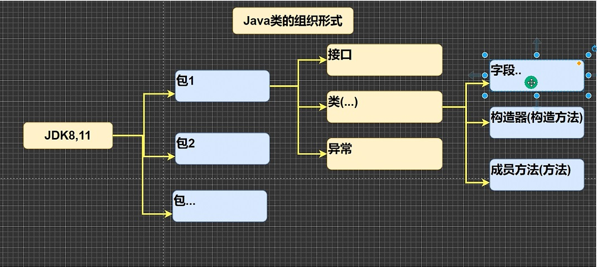

# 2. 变量

## 2.1 变量简介

### 2.1.1 为什么需要变量

变量是程序的基本组成单位

不论是使用哪种高级程序语言编写的程序，变量都是其程序的基本组成单位，比如：

```java
// 变量有三个基本要素（类型 + 名称 + 值）
class Test {
   public static void main(String[] args) {
      int a = 1; // 定义了一个变量，类型int整形,名称a,值是1
      int b = 3; // 定义了一个变量，类型int整形,名称b,值是3
      b = 89; // 把89值赋给b
      System.out.println(a); // 输出a变量的值
      System.out.println(b); // 输出b变量的值
   }
}
```

### 2.1.2 变量的介绍

变量相当于内存一个数据存储空间的表示，你可以把变量看做是一个房间的门牌号，通过门牌号我们可以找到房间，而通过变量名可以访问到变量（值）

### 2.1.3 变量使用的步骤

1. 声明变量
   > int a;
2. 赋值
   > a = 60; // 应该这么说：把60赋给a
3. 使用System.out.println(a);
   
也可以一步到位：`int a = 60;` 通常我们是一步完成的

### 2.1.4 变量使用的注意事项

1. 变量表示内存中的一个存储区域【不同的数据类型使用的空间大小不一样，比如int占4个字节，double占8个字节】
2. 该区域有自己的名称【变量名】和类型【数据类型】
3. 变量必须先声明后使用
4. 该区域的数据可以在同一类型范围内不断变化
5. 变量在同一个作用域不可以重名
6. 变量 = 变量名 + 值 + 数据类型，变量三要素

### 2.1.5 程序中"+"号的使用

1. 当左右两边都是数值类型时，则做加法运算
2. 当左右两边一方是字符串，则做拼接运算

## 2.2 Java数据类型

- Java数据类型分为两大类：基本数据类型、引用数据类型
- 基本数据类型中数值型[byte, short, int, long, float, double] char, boolean
- 引用类型[类, 接口, 数组]

1. 基本数据类型
   1. 数值型
      1. 整数类型，存放整数
         1. byte[1]
         2. short[2]
         3. int[4]
         4. long[4]
      2. 浮点（小数）类型
         1. float[4]
         2. double[8]
   2. 字符型 char[2]，存放单个字符
   3. 布尔型 boolean[1]，存放true和false
2. 引用数据类型
   1. 类 class
   2. 接口 interface
   3. 数组 []

## 2.3 整数类型

### 2.3.1 整数类型的范围：

- byte -128~127
- short ...

### 2.3.2 整数的使用细节

1. Java各整数类型有固定的范围和字段长度，不受具体的OS[操作系统]的影响，以保证Java程序的可移植性。
2. Java整型常量（具体值）默认为int型，声明long型常量须后面加'l'或'L'
3. Java程序变量常声明为int型，除非不足以表示大数才用long
4. bit是计算机的最小存储单位。byte：计算机中基本存储单位，1byte = 8bit。

## 2.4 浮点类型

### 2.4.1 浮点类型的范围：

- float -3.403E38~3.403E38
- double ...

1. 关于浮点数在计算机中存放形式的简单说明，浮点数 = 符号位 + 指数位 + 尾数位
2. 尾数部分可能丢失，造成精度损失（小数都是近似值）

### 2.4.2 浮点型使用细节

1. 与整数型类似，Java浮点类型有固定的范围和字段长度，不受具体的OS[操作系统]的影响。[float 4个字节，double 8个字节]
2. Java的浮点型常量（具体值）默认为double型，声明为float型常量须在后面加'f'或'F'
3. 浮点型常量有两种表示形式
   1. 十进制表示法，如：如 5.12, 512.0f, .123（必须有小数点）
   2. 科学计数法，如 5.12e2【5.12*10^2】, 5.12E-2【5.12\*10^-2】

## 2.5 Java API文档使用

1. API （Application Programing Interface，应用程序编程接口）是Java提供的基本编程接口（Java提供的类还有相关方法）。中文在线文档：https://www.matools.com
2. Java提供了大量的基础类，因此Oracle公司也为这些类提供了相应的API文档
3. Java类的组织形式【见示意图】：
   
   

4. 通过包名查找类，或者直接检索

## 2.6 字符类型（char）

基本介绍：存放单个字符，2个byte大小

示例：

```java
char c1 = 'a';
char c2 = '中';
```

### 2.6.1 使用细节

1. 字符串常量使用单引号（''）括起来的单个字符。例如：char c1 = 'a';
2. Java中还允许使用转义字符 '\' 来将其后的字符转变为特殊字符型常量。例如：char c3 = '\n'; \n表示换行符
3. 在Java中，char的本质是一个整数，在输出时是unicode码对应的字符
4. 可以直接给char赋值一个整数，然后输出时他会按照unicode字符输出[97->a]
5. char类型是可以进行运算的，相当于一个整数，因为他有对应的unicode编码


### 2.6.2 字符类型的本质

1. 字符型存储到计算机时，需要将字符对应的码值，转换成二进制存储，比如'a'
存储：'a'=>97=>（二进制）110 0001=>存储
读取：（二进制）110 0001=>97=>'a'=>显示
2. 字符和码值的对应关系是通过字符编码表决定的

## 2.7 编码表

   > ASCII（128个字符 占用一个字节）
   >
   > Unicode编码（固定大小的编码 使用两个字节表示字符，字母和汉字统一都是占用两个字节，这样浪费空间）
   >
   > UTF-8（编码表，大小可变的编码，字母使用1个字节，汉字使用3个字节）
   > GBK（可以表示汉字，而且范围广，字母使用1个字节，汉字2个字节）
   >
   > GBK2312（可以表示汉字，GBK2312 < GBK)
   >
   > BIG5（繁体中文，台湾，香港）

## 2.8 布尔类型

true 和 false

### 使用细节

不可以用0或非0的整数代替false和true，这点和C语言不同

## 2.9 自动类型转换

### 2.9.1 介绍

当Java程序在进行赋值或运算时，精度小的类型自动转换为精度大的数据类型，这个就是自动类型转换。

**数据类型按精度（容量）大小顺序排序为（背，规则）**

- char -> int -> long -> float -> double
- byte -> short -> int -> long -> float -> double

```java
public class AutoConvert {

    // 编写一个main方法
    public static void main(String[] args) {
        // 演示自动转换
        int num = 'a'; // ok：char -> int
        double d1 = 80;// ok：int -> double
        System.out.println(num); // 97
        System.out.println(d1); // 80.0
    }
}
```

### 2.9.2 自动类型转换的细节

1. 有多种类型的数据混合运算时，系统首先自动将所有的数据转换成容量最大的那种数据类型，然后再进行计算
2. 当我们把精度（容量）大的数据类型赋值给精度（容量）小的数据类型时，就会报错，反之就会进行数据类型转换
3. (byte,short) 和 char 之间不会相互自动转换
4. byte, short, char 他们三者可以计算，在计算时首先转为int类型
5. boolean不参与运算
6. 表达式结果的类型自动提升为操作数中最大的类型

```java
public class AutoConvertDetail {
    // 编写一个main方法
    public static void main(String[] args) {
        // 细节1：有多种类型的数据混合运算时
        // 系统首先自动将所有的数据转换成容量最大的那种数据类型，然后再进行计算
        int n1 = 10; // ok
        // float d1 = n1 + 1.1; // 错误 n1 + 1.1 => 结果类型是 double
        // double d1 = n1 + 1.1; // 对 n1 + 1.1 => 结果类型是 double
        float d1 = n1 + 1.1f; // 对 n1 + 1.1 => 结果类型是 float

        // 细节2：当我们把精度（容量）大的数据类型赋值给精度（容量）小的数据类型时，就会报错，反之就会进行数据类型转换
        // int n2 = 1.1;

        // 细节3：(byte,short) 和 char 之间不会相互自动转换
        // 当把具体数赋给byte时，(1)先判断该数是否在byte范围内，如果是就可以
        byte b1 = 10; // 对 -128~127
        // int n2 = 1;
        // b1 = n2; // 如果是按变量赋值，判断值的类型
        // char c1 = b1; // 错误， 原因 byte 不能自动转成char

        // 细节4：byte, short, char 他们三者可以计算，在计算时首先转为int类型。
        byte b2 = 1;
        byte b3 = 1;
        short s1 = 1;
        // short s2 = b2 + s1; // 错， b2 + s1 => int
        int s2 = b2 + s1; // 对， b2 + s1 => int
        // byte b4 = b2 + b3; // 错误，b2 + b3 => int

        // 细节5：boolean不参与运算
        boolean pass = true;
        // int num100 = pass; // 布尔类型不参与类型的自动转换

        // 细节6：表达式结果的类型自动提升为操作数中最大的类型
        byte b4 = 1;
        short s3 = 100;
        int num200 = 1;
        double num300 = 1.1;

        double num500 = b3 + s3 + num200 + num300;
    }
}
```

## 2.10 强制类型转换

### 2.10.1 介绍

自动类型转换的逆过程，将容量大的数据类型转换为容量小的数据类型。使用时要加上强制转换符()，但可能造成精度降低或溢出，格外要注意。

```java
public class ForceConver {
    public static void main(String[] args) {
        // 演示强制类型转换
        int n1 = (int)1.9;
        System.out.println("n1=" + n1); // 1，造成精度损失

        int n2 = 2000;
        byte b1 = (byte)n2;
        System.out.println("b1=" + b1); // 造成数据溢出
    }
}
```

### 2.10.2 强制类型转换细节说明

1. 当进行数据的大小从 大->小，就需要使用强制类型转换
2. 强转符号仅对最近的操作数有效，往往会使用小括号提升优先级
3. char类型可以保存int的常量值，但不能保存int的变量值，需要强转
4. byte和short,char类型进行运算时，当作int类型处理

```java
public class ForceConverDetail {
    public static void main(String[] args) {
        // 演示强制类型转换
        // 强转符号仅对最近的操作数有效，往往会使用小括号提升优先级
        // int x = (int)10 * 3.5 + 6 * 1.5; // 编译错误：double -> int
        int x = (int)(10 * 3.5 + 6 * 1.5); // (int)44.0 -> 44
        System.out.println(x);

        char c1 = 100; // ok
        int m = 100; // ok
        // char c2 = m; //错误
        char c3 = (char)m; // ok
        System.out.println(c3); // 对应字符d
    }
}
```

### 2.10.3 强制类型转换练习题

判断能否通过编译
1. short s = 12; // ok
   
   s = s - 9; // 错误 int -> short

2. byte b = 10; // ok
   
   b + 11; // 错误 int -> byte

   b = (byte)(b + 11); // 正确，使用强转

3. char c = 'a'; // ok
   
   int i = 16; // ok

   float d = .314; // ok

   double result = c + i + d; // ok  float -> double

4. byte b = 16; // ok
   
   short s = 14; // ok

   short t = s + b; // 错误 int -> short

## 2.11 基本数据类型和String类型的转换

*  介绍

   在开发程序中，我们经常需要将一些基本数据类型转换为String类型。或者将String类型转换成基本数据类型。

*  基本类型转String类型

   语法：将基本类型的值+""即可

   ```java
   public class StringToBasic {
       public static void main(String[] args) {
           // 基本数据类型 -> String
           int n1 = 100;
           float f1 = 1.1f;
           double d1 = 4.5;
           boolean b1 = true;
           String s1 = n1 + "";
           String s2 = f1 + "";
           String s3 = d1 + "";
           String s4 = b1 + "";
           System.out.println(s1 + " " + s2 + " " + s3 + " " + s4);
       }
   }
   ```

*  String类型转基本数据类型

   语法：通过基本类型的包装类调用parseXX方法即可

   ```java
      public class StringToBasic {
          public static void main(String[] args) {
              // 基本数据类型 -> String
              int n1 = 100;
              float f1 = 1.1f;
              double d1 = 4.5;
              boolean b1 = true;
              String s1 = n1 + "";
              String s2 = f1 + "";
              String s3 = d1 + "";
              String s4 = b1 + "";
              System.out.println(s1 + " " + s2 + " " + s3 + " " + s4);
              System.out.println("======================");

              // String -> 对应的基本数据类型
              // 使用基本数据类型对应包装类的相应方法，得到基本数据类型
              String s5 = "123";
              int num1 = Integer.parseInt(s5);
              double num2 = Double.parseDouble(s5);
              float num3 = Float.parseFloat(s5);
              long num4 = Long.parseLong(s5);
              byte num5 = Byte.parseByte(s5);
              boolean b = Boolean.parseBoolean("true");
              short num6 = Short.parseShort(s5);
              System.out.println(num1);
              System.out.println(b);

              // 把字符串转成字符，含义：把字符串第一个字符取到
              System.out.println(s5.charAt(0));
          }
      }
   ```

### 2.11.1 注意事项

1. 在将String转为基本数据类型时，要确保String类型能够转换成有效的数据

   比如我们可以把“123”转换成一个整数，但是不能把“hello”转成整数

2. 如果格式不正确则会抛出异常，程序终止

## 2.12 本章作业

1. 阅读程序看看输出什么

```java
public class Homework01 {
    public static void main(String[] args) {
        int n1;
        n1 = 13;
        int n2;
        n2 = 17;
        int n3;
        n3 = n1 + n2;
        System.out.println("n3 = " + n3);
        int n4 = 38;
        int n5 = n4 - n3;
        System.out.println("n5 = " + n5);
    }
}
```

> 答：
>
> 30
>
> 8

2. 使用char类型，分别保存\n \t \r &#92;\ 1 2 3等字符，并打印输出

> 答：
> ```java
> public class Homework02 {
>     public static void main(String[] args) {
>         char c1 = '\n'; // 换行
>         char c2 = '\t'; // 制表位
>         char c3 = '\r'; // 回车
>         char c4 = '\\'; // 输出 \
>         char c5 = '1';
>         char c6 = '2';
>         char c7 = '3';
>         System.out.println(c1);
>         System.out.println(c2);
>         System.out.println(c3);
>         System.out.println(c4);
>         System.out.println(c5);
>         System.out.println(c6);
>         System.out.println(c7);
>     }
> }
> ```