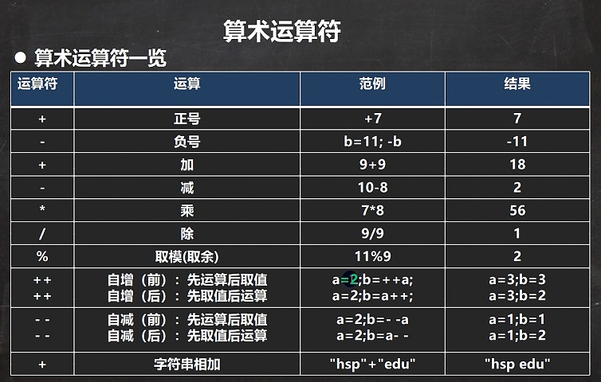
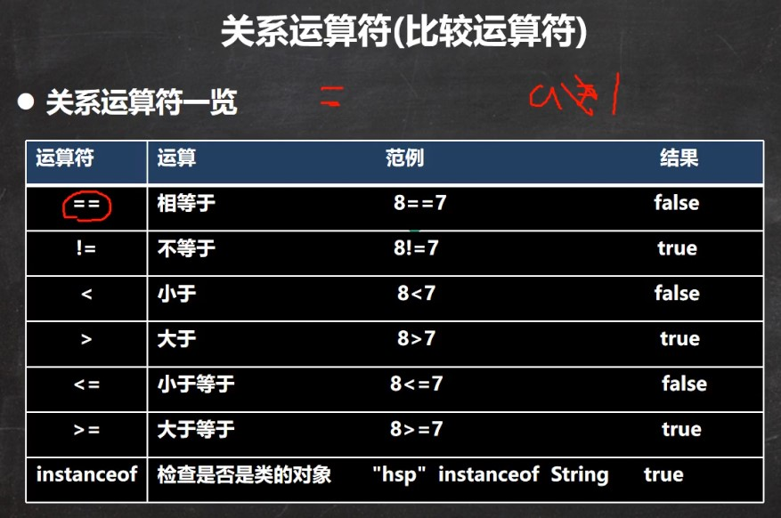
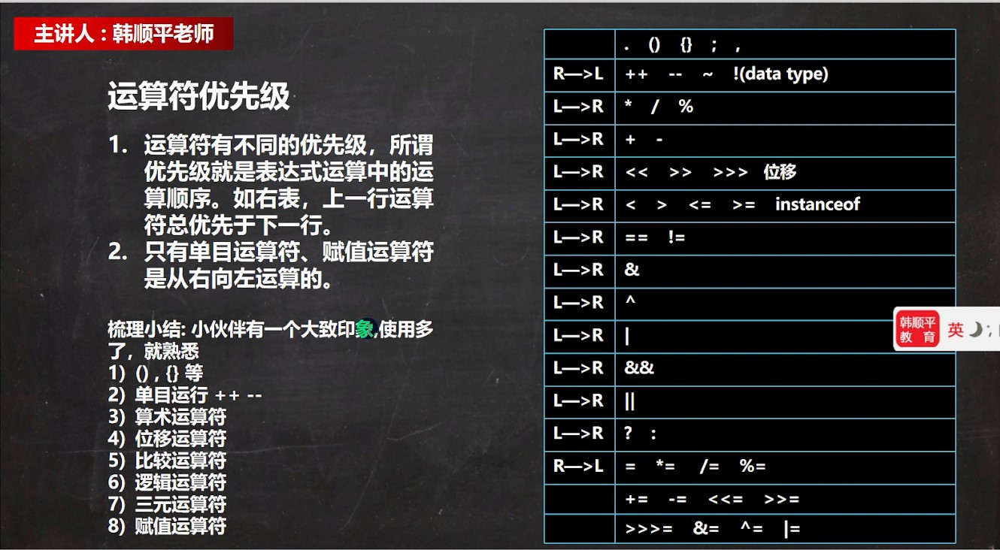

# 3. 运算符

## 3.1 算数运算符

**算术运算符一览**



### 3.1.1 案例演示

1.  +, -, *, /, %, ++, --

    重点：/, %, ++

    **除号"/"的使用**

    ```java
    System.out.println(10/4); // 从数学来看是2.5，Java中是2
    System.out.println(10.0/4); // Java是2.5
    double d = 10 / 4; // Java中10/4=2，2=>2.0
    System.out.println(d); // 是2.0
    ```

    **取模"%"的使用**

    ```java
    // % 取模，取余数
    // % 的本质，看一个公式：a % b = a - a / b * b
    System.out.println(10 % 3); // 1
    // -10 % 3 = -10 - (-10) / 3 * 3 = -1
    System.out.println(-10 % 3);
    // 10 % -3 = 10 - (10 / 3) * 3 = 1
    System.out.println(10 % -3);
    // -10 % -3 = -10 - (-10) / (-3) * (-3) = -1
    System.out.println(-10 % -3);
    ```

    **自增"++"的使用**

    * 前++：++i先自增后赋值
    * 后++：i++先赋值后自增

    ```java
    int j = 8;
    // int k = ++j; //等价于 j = j + 1; k = j;
    int k = j++; //等价于 k = j; j = j + 1;
    System.out.println("k=" + k + "j=" + j);
    ```

2.  自增: ++

    作为独立的语句使用：前++和后++都完全等价于 i=i+1;

    作为表达式使用：

    * 前++：++i先自增后赋值
    * 后++：i++先赋值后自增

3.  --, +, -, * 是一个道理，完全可以类推

### 3.1.2 练习1

1.  面试题1

    ```java
    int i=1;
    i=i++;
    System.out.println(i);
    ```
    
    问：结果是多少？为什么？

    > 答：
    > ```java
    > int i=1; // i->1
    > i=i++; // 规则使用临时变量:(1)temp=i;(2)i=i+1;(3)i=temp;
    > System.out.println(i);// 1
    > ```

2.  面试题2

    ```java
    int i=1;
    i=++i;
    System.out.println(i);
    ```

    > 答：
    > ```java
    > int i=1; // i->1
    > i=i++; // 规则使用临时变量:(1)i=i+1;(2)temp=i;(3)i=temp;
    > System.out.println(i);// 2
    > ```

### 3.1.3 自增自减练习题

```java
int i1 = 10;
int i2 = 20;
int i = i1++;
System.out.println("i="+i);
System.out.println("i2="+i2);
i = --i2;
System.out.println("i="+i);
System.out.println("i2="+i2);
```

> i=20
> i2=20
> i=19
> i2=19

### 3.1.4 练习2

1. 假如还有59天房价，问：合xx个星期零xx天

    ```java
    // 1. 需求：
    // 假如还有59天房价，问：合xx个星期零xx天
    // 2. 思路分析
    // (1) 使用int变量 days 保存天数
    // (2) 一个星期是7天 星期数：days / 7 零xx天 days % 7
    // (3) 输出
    // 3. 走代码
    int days = 59;
    int weeks = days / 7;
    int leftDays = days % 7;
    System.out.println(days + "天 合" + weeks + "星期零" +leftDays + "天");
    ```

2. 定义一个变量保存华氏温度，华氏温度转换摄氏温度的公式为：5/9*(华氏温度-100)，请求出华氏温度对应的摄氏温度。[234.5]

    ```java
    // 1. 需求：
    // 定义一个变量保存华氏温度，华氏温度转换摄氏温度的公式为：5/9*(华氏温度-100)，请求出华氏温度对应的摄氏温度。[234.6]
    // 2. 思路分析
    // (1) 先定义double变量保存华氏温度
    // (2) 根据给出的公式进行计算即可
    //（需要考虑数学公式和Java语言的特性）
    // (3) 将得到的结果保存到double 摄氏温度
    // 3. 走代码
    double huaShi = 234.6;
    double sheShi = 5.0 / 9 * (huaShi - 100);
    System.out.println("华氏温度"+huaShi+"对应的摄氏温度="+sheShi);
    ```

## 3.2 关系运算符

**关系运算符一览**



**细节说明**

1. 关系运算符的结果都是`boolean`型，也就是要么true，要么false。
2. 关系运算符组成的表达式，我们称之为**关系表达式**。a>b
3. 比较运算符"=="不能误写成"="

## 3.3 逻辑运算符

* 分两组学习
    1. 短路与&&，短路或||，取反!
    2. 逻辑与&，逻辑或|，逻辑异或^
* 说明逻辑运算规则
    1. a&b：逻辑与，同真才真
    2. a&&b：短路与，同真才真
    3. a|b：逻辑或，有真为真
    4. a||b：短路或，有真为真
    5. !a：取反，真的变成假的，假的变成真的
    6. a^b：a和b不同为真

* &&和&的使用区别
    1. &&短路与：如果第一个条件为false，则第二个条件不会判断
    2. &逻辑与：不管第一个条件是否为false，第二个条件仍然会判断
    3. 开发中，我们基本常使用的是短路&&，效率高

* ||和|的使用区别
    1. ||短路或：如果第一个条件为true，则第二个条件不会判断，最终结果为true，效率高
    2. |逻辑或：不管第一个条件是否为true，第二个条件都要判断
    3. 开发中基本常用短路或||

## 3.4 赋值运算符细节

复合赋值运算符会进行类型转换：

```java
byte b = 3;
b += 2; // 等价于 b = (byte)(b+2);
b++; // b = (byte)b+1;
```

## 3.5 三元运算符

*   基本语法

    条件表达式?表达式1:表达式2;

    运算规则：

    1. 如果条件表达式为true,运算后的结果是表达式1
    2. 如果条件表达式为false，运算后的结果为表达式2

*   案例演示

    ```java
    int a = 10;
    int b = 99;
    int result = a>b? a++:b--; // 99
    ```

*   使用细节

    1. 表达式1和表达式2要为可以赋给接收变量的类型（或可以自动转换/或者强制转换）

    ```java
    int a = 3;
    int b = 8;
    int c = a > b? 1.1:3.4; // 错误，编译时报错
    ```

    2. 三元运算符可以转成if--else语句

## 3.6 运算符优先级



## 3.7 标识符的命名规则和规范

* 标识符概念
    1. Java对各种变量、方法和类等命名时使用的字符序列称为标识符
    2. 凡是自己可以起名字的地方都叫标识符 `int num1 = 90;`
* 标识符的命名规则（必须遵守）
    1. 由26个英文字母大小写，0-9，_或$组成
    2. 数字不可以开头。 `int 3ab = 1; `:x:
    3. 不可以使用关键字和保留字，但能包含关键字和保留字
    4. Java中严格区分大小写，长度无限制。`int totalNum = 10;int n=90;`
    5. 标识符不能包含空格。`int a b = 90;` :x:
* 标识符命名规范
    1. 包名：多单词组成时所有字母都小写：aaa.bbb.ccc // 比如com.hsp.crm
    2. 类名、接口名：多单词组成时，所有单词的首字母大写：XxxYyyZzz **[大驼峰法]** 比如：TankShotGame
    3. 变量名、方法名：多单词组成时：首字母小写，第二个单词开始首字母大写 xxxYyyZzz **[小驼峰，简称 驼峰法]** 比如：tankShotGame
    4. 常量名：所有字母都大写。多单词时每个单词用下划线连接

## 3.8 关键字

定义：被Java语言赋予了特殊含义，用作专门用途的单词

特点：所有字母都为小写

太多不一一列举...

## 3.9 保留字

现有Java版本尚未使用，但以后版本可能会作为关键字使用。自己命名标识符时要避免使用这些保留字。

