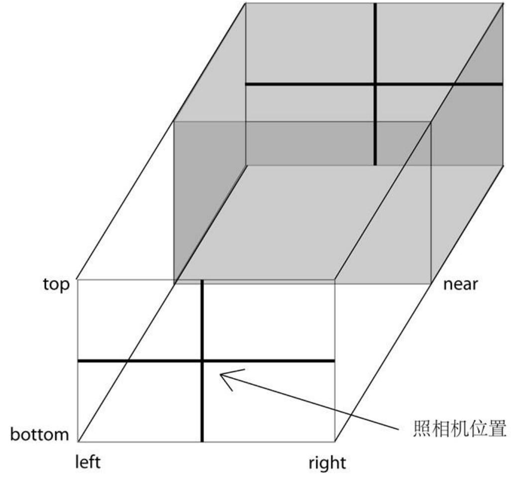

<!-- <script setup>
    import Nerv3D from '../../../components/Nerv3D.vue'
</script> -->

# 初探three.js

**three.js**正如它的名字那样是一个3D图形库。其作者mrdoob在README.md直接简单明了地写道JavaScript 3D library，简短的介绍背后是强大的自信。

在浏览器中使用WebGL的原生API费时费力，此外还需要学习并使用OpenGL Shading Language（GLSL）编写着色器语言。

使用three.js不需要自己编写GLSL，也不需要掌握计算机图形学知识，上手十分简单，同时不缺乏灵活性，你也可以自己使用GLSL编写着色器。

本文简单介绍three.js的几个知识，10分钟就可以做出如首页中的旋转的3D logo。

<!-- <Nerv3D></Nerv3D> -->

## 安装和使用

安装

```shell
$ npm i three
```

使用

```javascript
import * as THREE from 'three'
```

此外，若想进一步缩小体积可以仅导入你所需要的部分

```javascript
import { Scene } from 'three';
```

three.js的核心专注于3D引擎最重要的组件。其它很多有用的组件 —— 如控制器（control）、加载器（loader）以及后期处理效果（post-processing effect） —— 是 examples/jsm 目录的一部分。它们被称为“示例”，虽然你可以直接将它们拿来使用，但它们也需要重新混合以及定制。

```javascript
import { OrbitControls } from 'three/addons/controls/OrbitControls.js';

const controls = new OrbitControls( camera, renderer.domElement );
```

three.js还是面向对象的，任何子类可以访问基类拥有的属性和方法。比如`PerspectiveCamera`继承了`Camera`，`BoxGeometry`继承了`BufferGeometry`。

## 坐标系

three.js使用右手坐标系


## 摄像机

常用的有透视相机（PerspectiveCamera）、正交相机（OrthographicCamera）

### 透视相机

透视相机类似人眼观察世界时的样子——近大远小

此处描绘了一个正方体，可以看见正方形的12条边，而且后面的边比前面的小


透视相机的构造函数如下所示

PerspectiveCamera( fov : Number, aspect : Number, near : Number, far : Number )

参数意义：

* fov — 摄像机视锥体垂直视野角度
* aspect — 摄像机视锥体长宽比
* near — 摄像机视锥体近端面
* far — 摄像机视锥体远端面


### 正交相机

正交相机类似数学课上老师画的那样，不会产生近大远小，而且几何体平行的边在摄像机里看也是平行的。在这种投影模式下，无论物体距离相机距离远或者近，在最终渲染的图片中物体的大小都保持不变。

此处也是描绘了一个正方形，前面的边和后面的边重合了


正交相机的构造函数如下所示

OrthographicCamera( left : Number, right : Number, top : Number, bottom : Number, near : Number, far : Number )

参数意义：

* left — 摄像机视锥体左侧面。
* right — 摄像机视锥体右侧面。
* top — 摄像机视锥体上侧面。
* bottom — 摄像机视锥体下侧面。
* near — 摄像机视锥体近端面。
* far — 摄像机视锥体远端面。



## 几何体

three.js内置了多种几何体，基本上看官方的文档就能立即使用。

简单介绍一下立方体

**构造器**

BoxGeometry(width : Float, height : Float, depth : Float, widthSegments : Integer, heightSegments : Integer, depthSegments : Integer)

* width — X轴上面的宽度，默认值为1。
* height — Y轴上面的高度，默认值为1。
* depth — Z轴上面的深度，默认值为1。
* widthSegments — （可选）宽度的分段数，默认值是1。
* heightSegments — （可选）高度的分段数，默认值是1。
* depthSegments — （可选）深度的分段数，默认值是1。

分段数越多，几何体越精细，比如说球体的经线和纬线的分段数越多整个球就越像个球。

<iframe width="100%" height="300px" src="https://threejs.org/docs/scenes/geometry-browser.html#BoxGeometry"></iframe>

```javascript
const geometry = new THREE.BoxGeometry( 1, 1, 1 );
const material = new THREE.MeshBasicMaterial( {color: 0x00ff00} );
const cube = new THREE.Mesh( geometry, material );
scene.add( cube );
```
